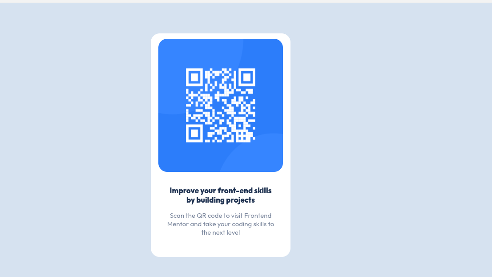

# QR code component card

Repository contains a qr code when scanned redirects to frontendmentor.io


- [Overview](#overview)
  - [Screenshot](#screenshot)
  - [Links](#links)
- [My process](#my-process)
  - [Built with](#built-with)
  - [What I learned](#what-i-learned)
  - [Continued development](#continued-development)
  - [Useful resources](#useful-resources)
- [Author](#author)
- [Acknowledgments](#acknowledgments)

# Overview 
 Repository contains a qr code when scanned redirects to frontendmentor.io

### Screenshot


## My process

### Built with
* Semantic HTML markup
* CSS custom properties

### What I learned
Building anything require what I would term "layering", placing each part layer by layer. This project wasn't quite straightforward for me as I was unsure about how exactly to begin.
Making an image scale with the <div> was one area where I was usually incapable of resolving. However, this was soretd in the code shown below

```
.image-div {
    border-radius: 20px;
    width: 90%;
    height: 60%;
    margin: 0 auto;
    margin-top: 10px;
}

.image-div img {
    width: 100%;
    height: 100%;
    object-fit: fill;
    border-radius: 20px;
}

```

### Continued development
Code will be reviewed to make sure it it absolutely responsive across multiple devices

## Author
Frontend Mentor - [@kinghorey](https://www.frontendmentor.io/profile/KingHorey)

Twitter - [@kinghorey](https://twitter.com/kinghorey)


